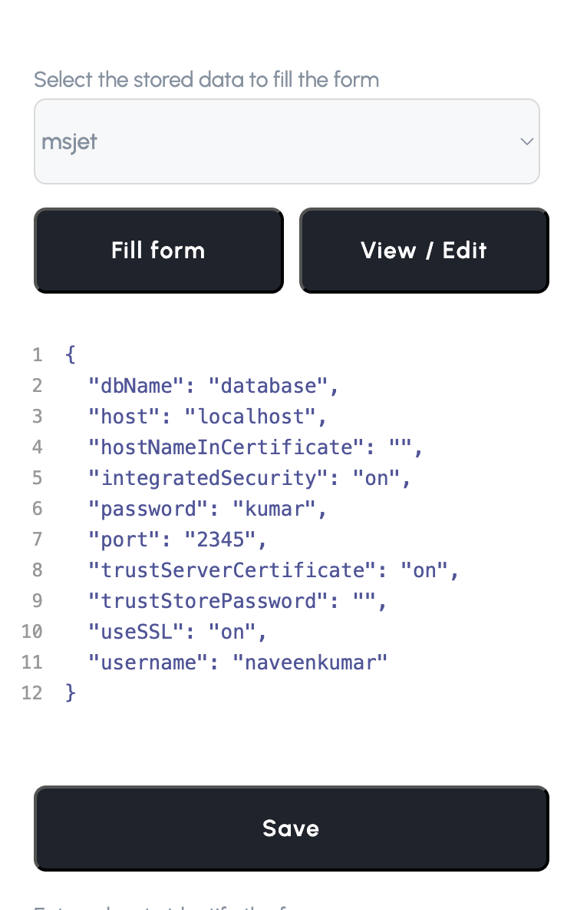
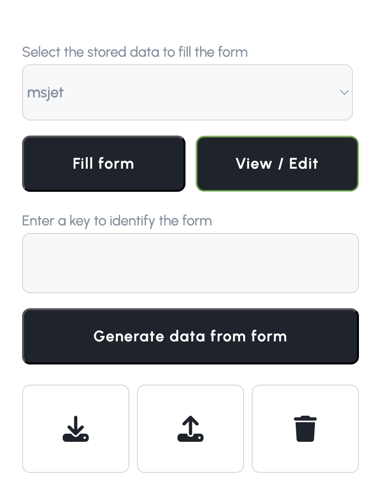

#  Autofill

A chrome extension that helps to fill forms automatically with stored data. It can also access the values from the form and genearte values that can be used to fill the form for the next time.

## Features

- View/Edit stored data
  - Built in json editor that enables us to edit the stored data for the specific form.
- Generate form data
  - The extension gets the data from the form and generate a new json data.
- Fill the form with stored values
  - Users can fill the forms with values that are already generated or imported.
- Export stored data
  - The data that has been generated can be exported as a json file
- Import shared data
  - Get the values used by others,import them as a json file and use it in your machine.

## Screenshots

## Installlation Guide

`npm i`

`npm run build`

## Contribution

Suggestions and pull requests are welcomed!.
